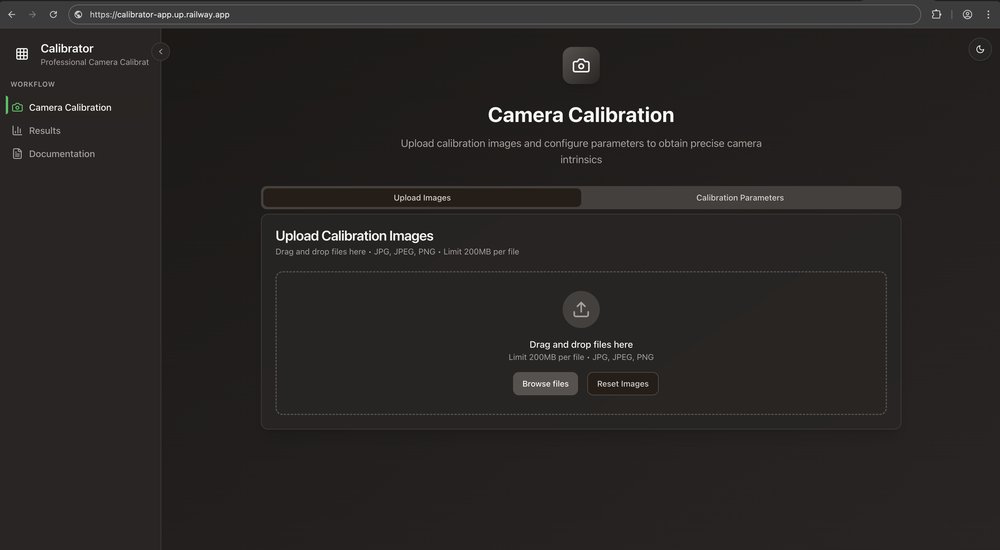

# Camera Calibration App



A full-stack web application for camera calibration using OpenCV. Upload images of calibration patterns and obtain camera intrinsic and extrinsic parameters for computer vision applications.

## Features

- 📸 Camera calibration using checkerboard patterns
- 🎯 Support for both monocular and stereo camera calibration
- 📊 Interactive visualization of calibration results
- 💾 Save and manage calibration data
- 🔄 RESTful API for programmatic access
- 🎨 Modern, responsive UI with dark mode support

## Tech Stack

### Backend
- **FastAPI** - High-performance Python web framework
- **OpenCV** - Computer vision library for calibration algorithms
- **SQLite** - Database for storing calibration data
- **Uvicorn** - ASGI server

### Frontend
- **React 18** - UI framework
- **TypeScript** - Type-safe development
- **Vite** - Fast build tool
- **shadcn/ui** - Modern component library
- **Tailwind CSS** - Utility-first CSS framework
- **Plotly.js** - Interactive plotting library
- **TanStack Query** - Data fetching and caching

## Prerequisites

- Python 3.8+
- Node.js 16+
- npm or bun

## Installation

### Backend Setup

1. Install Python dependencies:
```bash
pip install -r requirements.txt
```

2. Initialize the database (optional):
```bash
python backend/init_db.py
```

### Frontend Setup

1. Navigate to the frontend directory:
```bash
cd frontend
```

2. Install dependencies:
```bash
npm install
```

## Running the Application

### Development Mode

**Terminal 1 - Backend (Port 8000):**
```bash
python -m uvicorn backend.main:app --reload --host 127.0.0.1 --port 8000
```

**Terminal 2 - Frontend (Port 8080):**
```bash
cd frontend
npm run dev
```

Access the app at:
- **Frontend**: http://localhost:8080
- **Backend API**: http://127.0.0.1:8000
- **API Docs**: http://127.0.0.1:8000/docs

### Production Mode

1. **Build the frontend:**
```bash
cd frontend
npm run build
```

2. **Run the backend** (which will serve the built frontend):
```bash
uvicorn backend.main:app --host 0.0.0.0 --port 8000
```

The application will be available at `http://localhost:8000`.

### Docker

Build and run using Docker:
```bash
docker build -t calibrator-app .
docker run -p 8000:8000 calibrator-app
```

## Project Structure

```
calibrator-app/
├── backend/              # FastAPI backend
│   ├── routers/          # API route handlers
│   ├── utils/            # Calibration utilities
│   ├── main.py           # FastAPI app entry point
│   ├── database.py       # Database models
│   └── requirements.txt  # Python dependencies
├── frontend/             # React frontend
│   ├── src/              # Source code
│   │   ├── components/   # React components
│   │   ├── pages/        # Page components
│   │   └── lib/          # Utilities
│   ├── public/           # Static assets
│   └── package.json      # Node dependencies
├── utils_calibration.py  # Calibration algorithms
├── utils_plot.py         # Plotting utilities
├── Dockerfile            # Docker configuration
└── README.md             # This file
```

## API Documentation

Once the backend is running, visit:
- **Swagger UI**: `http://localhost:8000/docs`
- **ReDoc**: `http://localhost:8000/redoc`
- **OpenAPI JSON**: `http://localhost:8000/openapi.json`

## Usage

### Quick Start

1. **Prepare Images**: Capture 20-30 images of a checkerboard pattern from different angles
2. **Upload**: Drag and drop images into the web interface
3. **Configure**: Set checkerboard dimensions (rows, columns) and square size (mm)
4. **Preview**: Click "Preview Pattern Detection" to verify corner detection works
5. **Calibrate**: Click "Start Calibration" to process all images
6. **Download**: Click "Download JSON" to get calibration parameters
7. **Use**: Apply parameters in your application (see [USAGE_EXAMPLES.md](USAGE_EXAMPLES.md))

### Workflow

```
Upload Images → Preview Detection → Run Calibration → View Results → Download JSON
```

### Documentation

- **[CALIBRATION_PIPELINE.md](CALIBRATION_PIPELINE.md)** - Complete pipeline documentation
- **[USAGE_EXAMPLES.md](USAGE_EXAMPLES.md)** - Code examples for using calibration data
- **[CLEANUP.md](CLEANUP.md)** - Image cleanup and maintenance

## License

This project is available for personal and commercial use.

## Contributing

Contributions are welcome! Please feel free to submit a Pull Request.
